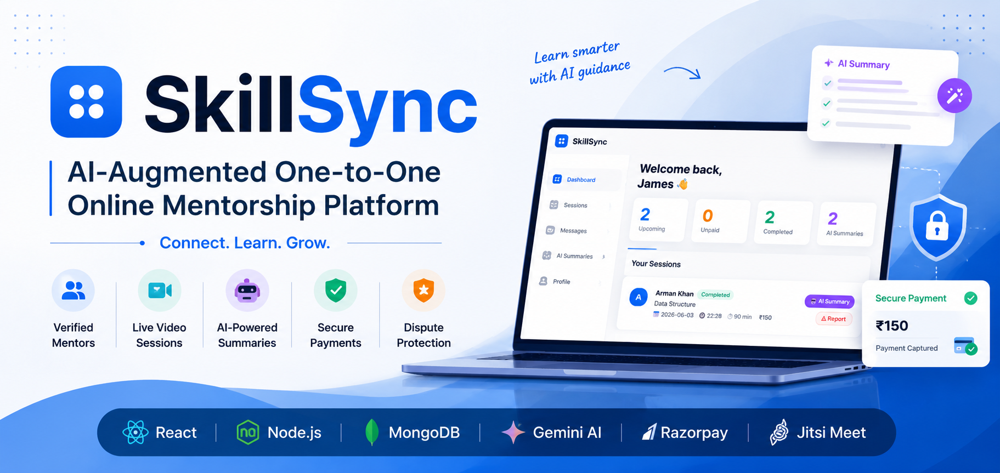
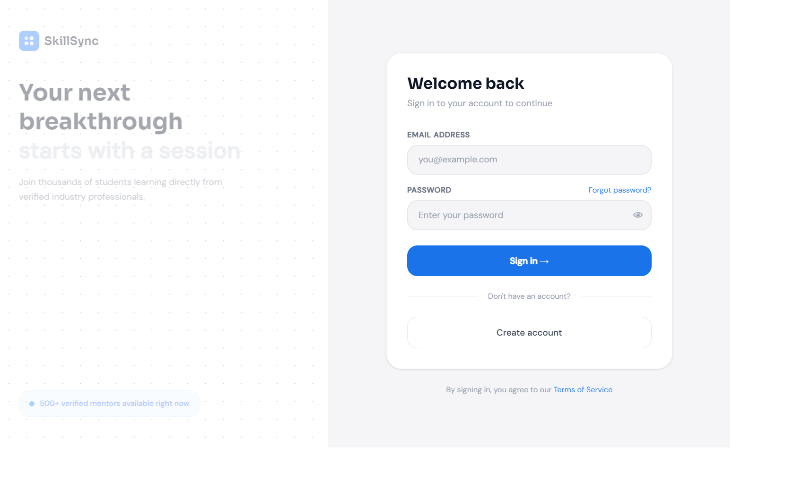
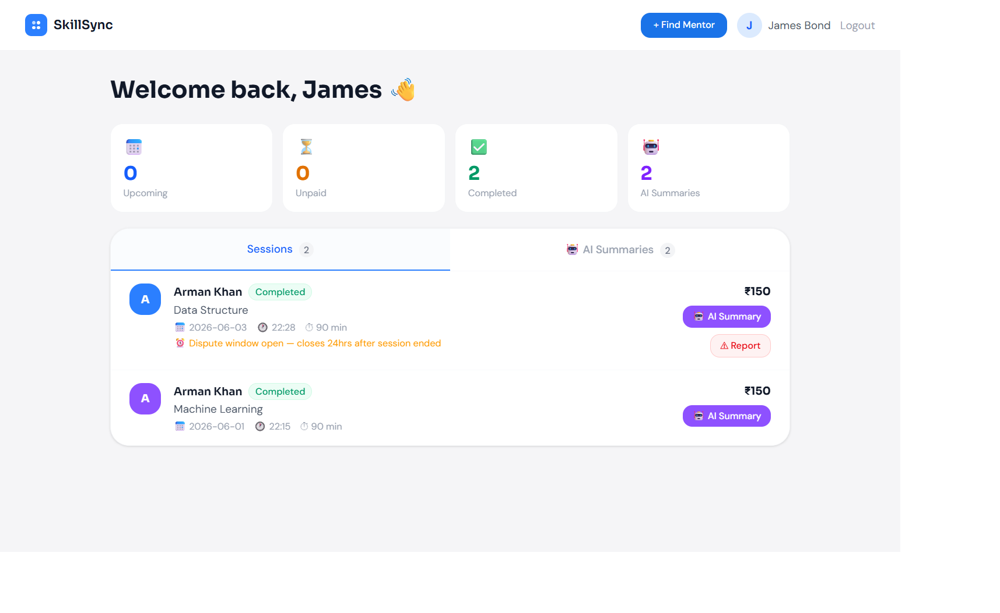
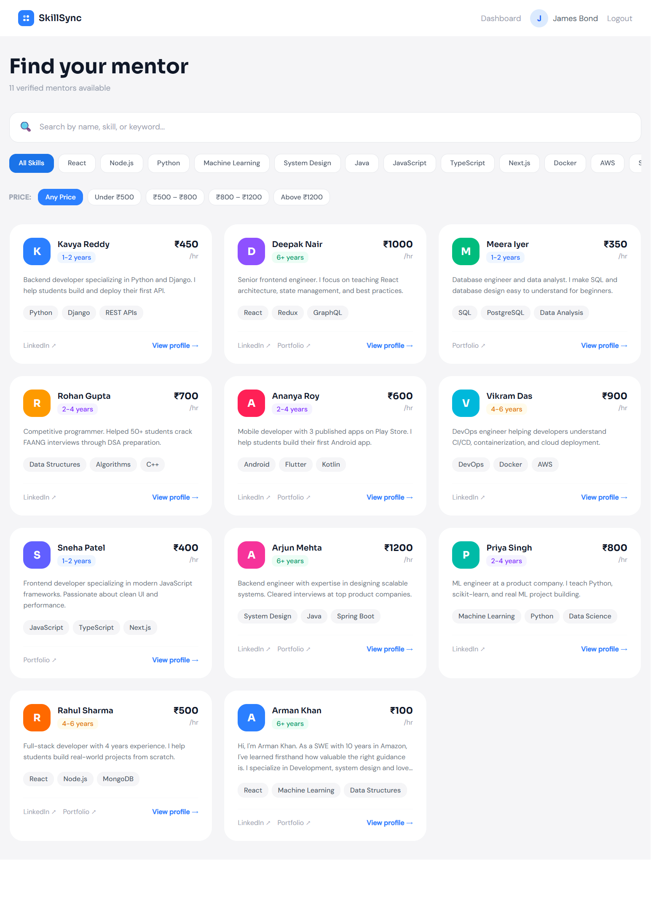
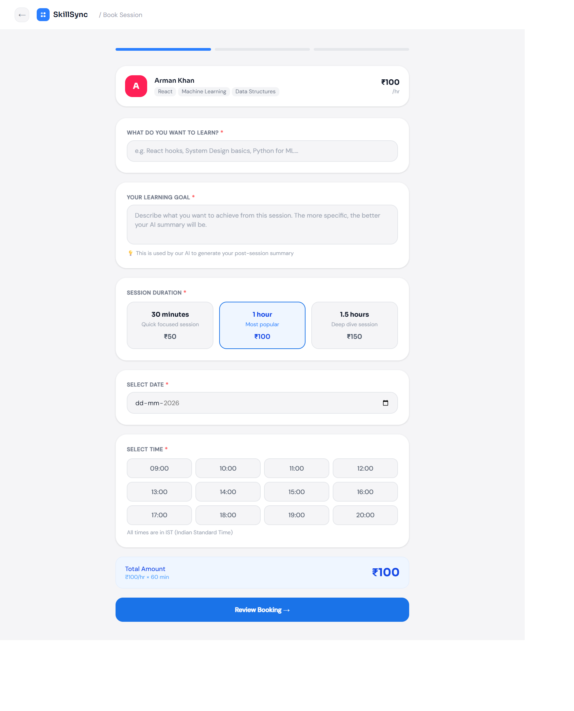
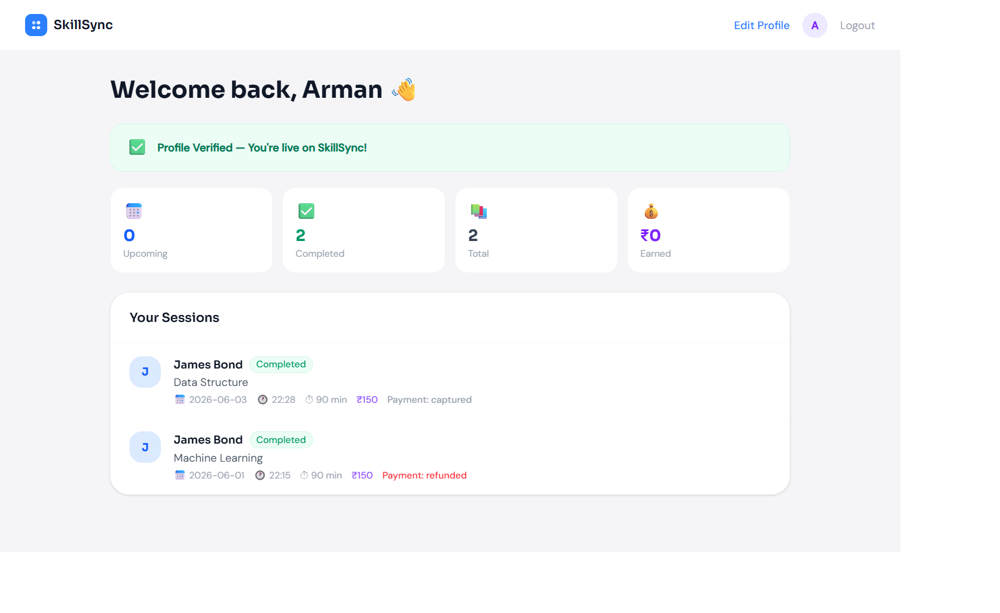
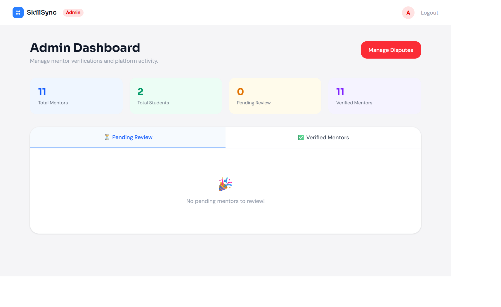

# SkillSync 🚀

<p align="center">
  
</p>

<div align="center">

### AI-Augmented One-to-One Online Mentorship Platform

Connect • Learn • Grow

React • Node.js • MongoDB • Gemini AI • Razorpay • Jitsi Meet

</div>

SkillSync is a full-stack mentorship platform that connects students with verified mentors for personalized one-on-one learning sessions. The platform combines secure payments, video conferencing, AI-powered learning summaries, messaging, mentor verification, and dispute management into a single ecosystem.

Built as an MCA Final Year Project, SkillSync aims to bridge the gap between learners and experienced professionals through structured mentorship and guided learning.

---

## 🌟 Key Highlights

- 🔐 JWT Authentication & Role-Based Access Control
- 🎓 Student, Mentor, and Admin Dashboards
- 👨‍🏫 Verified Mentor Discovery Platform
- 📅 Session Booking & Scheduling System
- 💳 Secure Payments via Razorpay
- 🎥 Live Video Sessions using Jitsi Meet
- 🤖 AI-Generated Session Summaries using Google Gemini
- 💬 Built-in Student–Mentor Messaging
- ⚖️ Dispute Resolution & Refund Workflow
- 🛡️ Mentor Verification System
- 📊 Admin Monitoring & Management Panel

---

## 📸 Application Screenshots

### Landing Page

<p align="center">
  
</p>

### Login Page

<span align="center">
  
</span>

### Student Dashboard

<span align="center">
  
</span>

### Browse Mentors

<span align="center">
  
</span>

### Session Booking

<span align="center">
  
</span>

### Mentor Dashboard

<span align="center">
  
</span>

### Admin Dashboard

<span align="center">
  
</span>

---

# 🎯 Problem Statement

Many students struggle to find reliable mentorship, practical guidance, and personalized learning support.

Existing learning platforms focus primarily on pre-recorded content and often lack:

- One-to-one mentorship
- Personalized guidance
- Practical project support
- Career-focused discussions
- Session accountability

SkillSync solves these challenges by enabling direct student–mentor interactions through structured mentorship sessions.

---

# 👥 User Roles

## Student

Students can:

- ✅ Register and log in
- ✅ Browse verified mentors
- ✅ Filter mentors by skills and pricing
- ✅ Book mentorship sessions
- ✅ Pay securely via Razorpay
- ✅ Join live sessions
- ✅ Chat with mentors
- ✅ Receive AI-generated learning summaries
- ✅ Raise disputes if required

---

## Mentor

Mentors can:

- ✅ Create and edit profiles
- ✅ Add skills and portfolio links
- ✅ Receive booking requests
- ✅ Conduct live mentorship sessions
- ✅ Communicate with students
- ✅ Earn payments after successful sessions

---

## Admin

Admins can:

- ✅ Verify mentor profiles
- ✅ Review pending mentor applications
- ✅ Monitor platform activity
- ✅ Resolve disputes
- ✅ Manage platform integrity

---

# ✨ Features

## 🔐 Authentication & Authorization

- JWT Authentication
- Password hashing using bcryptjs
- Protected routes
- Student/Mentor/Admin roles

---

## 💡 Mentor Discovery

- Browse verified mentors
- Skill-based filtering
- Price-based filtering
- Keyword search
- Mentor profiles

---

## 📅 Session Booking

- Select mentor
- Define learning goals
- Choose duration
- Schedule date and time
- Automatic session creation

---

## 💵 Payment Management

- Razorpay Integration
- Secure payment verification
- Payment tracking
- Escrow-style holding mechanism
- Automatic payment release workflow

---

## 🎥 Live Video Sessions

- Jitsi Meet Integration
- Session-specific meeting rooms
- Secure access for booked participants
- Browser-based video calling

---

## 💬 Messaging System

- Session-specific conversations
- Student ↔ Mentor communication
- Persistent message history

---

## 🤖 AI-Powered Learning Summaries

After a session is completed:

Google Gemini automatically generates:

- Session summary
- Action items
- Learning recommendations
- Follow-up resources

---

## 🔔 Dispute Management

Students can:

- Raise disputes
- Explain session issues
- Request refunds

Admins can:

- Review evidence
- Approve refunds
- Reject disputes
- Release mentor payments

---

## 🛡️ Mentor Verification System

Mentor applications require:

- Professional bio
- Skill details
- LinkedIn profile
- Portfolio links

Admin verification ensures quality mentorship.

---

# 🏗️ System Architecture

```text
Frontend (React + Vite)
          │
          ▼
Backend API (Node.js + Express)
          │
          ▼
MongoDB Atlas Database
          │
 ┌────────┼────────┐
 ▼        ▼        ▼
Gemini  Razorpay  Jitsi Meet
 AI     Payments  Video Calls
```

---

# 🛠️ Tech Stack

## Frontend

- React.js
- Vite
- React Router DOM
- Axios
- Tailwind CSS

---

## Backend

- Node.js
- Express.js
- MongoDB
- Mongoose
- JWT
- bcryptjs

---

## Third-Party Services

### Google Gemini

Used for:

- AI Session Summaries
- Action Items
- Learning Recommendations

---

### Razorpay

Used for:

- Session Payments
- Payment Verification
- Refund Workflow

---

### Jitsi Meet

Used for:

- Video Conferencing
- Live Mentorship Sessions

---

# 📂 Project Structure

```text
└── SkillSync/
    ├── skillSync-backend/
    │   ├── config/
    │   │   └── db.js
    │   ├── controllers/
    │   │   ├── adminControllers.js
    │   │   ├── adminDisputeControllers.js
    │   │   ├── aiControllers.js
    │   │   ├── authControllers.js
    │   │   ├── disputeControllers.js
    │   │   ├── mentorControllers.js
    │   │   ├── messageControllers.js
    │   │   ├── paymentControllers.js
    │   │   └── sessionControllers.js
    │   ├── middleware/
    │   │   ├── authMiddleware.js
    │   │   └── roleMiddleware.js
    │   ├── models/
    │   │   ├── AIsummary.js
    │   │   ├── Dispute.js
    │   │   ├── MentorProfile.js
    │   │   ├── Message.js
    │   │   ├── Payment.js
    │   │   ├── Session.js
    │   │   └── User.js
    │   ├── routes/
    │   │   ├── adminRoutes.js
    │   │   ├── aiRoutes.js
    │   │   ├── authRoutes.js
    │   │   ├── disputeRoutes.js
    │   │   ├── mentorRoutes.js
    │   │   ├── messageRoutes.js
    │   │   ├── paymentRoutes.js
    │   │   ├── sessionRoutes.js
    │   │   └── videoRoutes.js
    │   ├── .gitignore
    │   ├── .env
    │   ├── server.js
    │   ├── package.json
    │   └── package-lock.json
    └── skillSync-frontend/
        ├── public/
        ├── src/
        │   ├── api/
        │   │   └── axios.js
        │   ├── components/
        │   │   ├── chatThread.jsx
        │   │   ├── DisputeForm.jsx
        │   │   └── ProtectedRoute.jsx
        │   ├── hooks/
        │   │   ├── useAuth.js
        │   │   └── useHomeNavigate.js
        │   ├── pages/
        │   │   ├── admin/
        │   │   │   ├── AdminDashboard.jsx
        │   │   │   └── ManageDisputes.jsx
        │   │   ├── auth/
        │   │   │   ├── Login.jsx
        │   │   │   └── Register.jsx
        │   │   ├── mentor/
        │   │   │   ├── EditProfile.jsx
        │   │   │   ├── MentorDashboard.jsx
        │   │   │   └── MentorSessionRoom.jsx
        │   │   ├── student/
        │   │   │   ├── AISummaryPage.jsx
        │   │   │   ├── BookSession.jsx
        │   │   │   ├── BrowseMentors.jsx
        │   │   │   ├── MentorProfile.jsx
        │   │   │   ├── PaymentPage.jsx
        │   │   │   ├── SessionRoom.jsx
        │   │   │   └── StudentDashboard.jsx
        │   │   └── LandingPage.jsx
        │   ├── app.jsx
        │   ├── index.css
        │   ├── main.jsx
        │   └── context/
        │       ├── authContext.jsx
        │       └── authContextValue.js
        ├── .gitignore
        ├── index.html
        ├── package.json
        ├── package-lock.json
        ├── vite.config.js
        ├── eslint.config.js
        └── .env

```

---

# ⚙️ Installation Guide

## Clone Repository

```bash
git clone https://github.com/Arman-next/SkillSync.git

cd SkillSync
```

---

## Backend Setup

```bash
cd skillsync-backend

npm install

npm run dev
```

Backend runs on:

```text
http://localhost:5000
```

---

## Frontend Setup

```bash
cd skillsync-frontend

npm install

npm run dev
```

Frontend runs on:

```text
http://localhost:5173
```

---

# 🔑 Environment Variables

## Backend (.env)

```env
PORT=5000

MONGO_URI=

JWT_SECRET=

RAZORPAY_KEY_ID=
RAZORPAY_KEY_SECRET=

GEMINI_API_KEY=
```

---

## Frontend (.env)

```env
VITE_API_URL=http://localhost:5000

VITE_RAZORPAY_KEY=
```

---

# 🔄 Session Lifecycle

```text
Student Books Session
            │
            ▼
      Payment Captured
            │
            ▼
      Session Confirmed
            │
            ▼
      Video Session Held
            │
            ▼
      Mentor Completes Session
            │
            ▼
      Gemini Generates Summary
            │
            ▼
   24-Hour Dispute Window
            │
            ▼
 Payment Released to Mentor
```

---

# 🚀 Future Enhancements

- Real-time messaging using Socket.IO
- AI Mentor Recommendation Engine
- Session Recording
- Learning Analytics Dashboard
- Mentor Rating System
- Mobile Application
- Email Notifications
- Calendar Integration
- Group Mentorship Sessions

---

# 📚 Academic Context

This project was developed as part of the requirements for the degree:

**Master of Computer Applications (MCA)**

**University of Kalyani**

Academic Year: **2025–2026**

---

# 👨‍💻 Author

**Arman Khan**

MCA Final Year Student

University of Kalyani

---

# ⭐ If you like this project

Give the repository a ⭐ on GitHub.

It helps others discover the project and motivates further development.

---

## License

This project is intended for educational and academic purposes.

No license has been specified.
